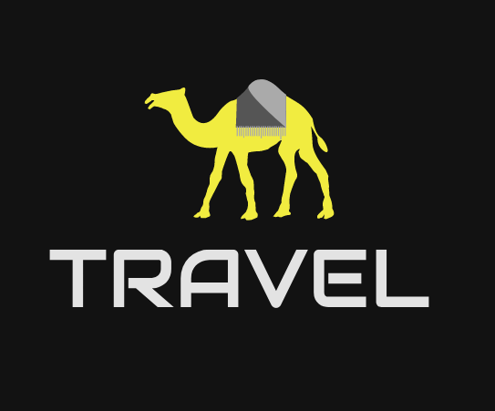

  

<h1 align = "center"> Travel Website </h1>

Responsive Travel Website Design Using HTML CSS and JavaScript 🌊   Dark/Light Mode 

  

## Description

  

## Features
 
Following are some of the new features and learning encountered while creating this amazing project:
-
  

## Resources
 
Follwing resources have been used in maing this project:
- [Google Fonts](https://fonts.google.com/) are used to import the **Railway** Font family into the project.
- [Remix Icons](https://remixicon.com/) are used to import icons into the website.
  

## Demo
  

## Link To Video
  

## GUI
  

## Technology Stack
 
Follwing technologies have been used at the core of this application to make it stand in the market place:
- HTML
- CSS
- JavaScript
  

## Advancement
  

## Deployment Details
The website is deployed using the free hosting provided by **Vercel**

  

  
Later on the link was customized using the well known url shortner and customizer **Rebrandly**:  

  

  

## Developer
Muhammad Abdullah Butt  
abdullahbutt12292210@gmail.com  
> [Instagram](https://www.instagram.com/abdullah.butt.22/) 
> [FaceBook](https://www.facebook.com/profile.php?id=100076291614529) 
> [YouTube](https://www.youtube.com/channel/UCnuOFQyMywg-KuoN-lmav1Q) 
> [Portfolio](https://rebrand.ly/muhammadabdullahPortfolio) 
> [Website](#)
